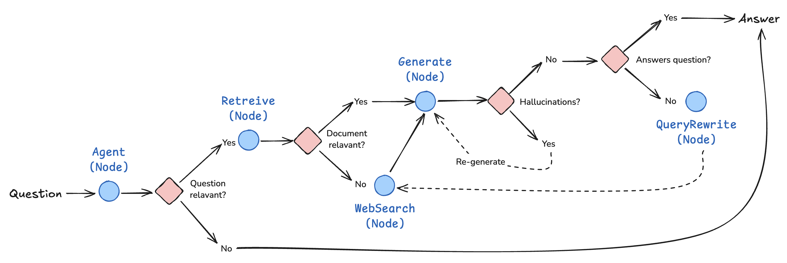

# Modular RAG Based Gifticon Image Finder
- GIF(Modular RAG Based Gifticon Image Finder)
- python version 3.11.10

## DEV 환경
### virtualenv를 통해 python 실행환경 설정  
$ virtualenv .venv --python=python3.11.10

### Swagger 접속
http://127.0.0.1:8088/docs

### Streamlit 실행
$ streamlit run streamlit.py --server.port=8501 --server.address=0.0.0.0 --server.headless=true --server.fileWatcherType=none --browser.gatherUsageStats=false

### Streamlit 접속
http://127.0.0.1:8501/

## PRODUCTION 환경
### Streamlit 실행
$ cd modular-rag-based-gifticon-image-finder 

$ scripts/start.sh  

또는  

$ cd arpo  

$ source bin/activate  

$ nohup streamlit run streamlit.py --server.port=8501 --server.address=0.0.0.0 --server.headless=true --server.fileWatcherType=none --browser.gatherUsageStats=false 1> ./logs/output.log 2>&1 &

## Modular RAG

- Modular-RAG 기반의 기프티콘 이미지를 자연어로 검색할 수 있는 모델 구현
- 사용자가 기프티콘 이미지 파일을 등록하면 정보를 추출하여 임베딩 벡터로 저장
- 사용자가 자연어로 검색하면 여러 모듈을 연결하며 각 결과를 평가하여 최적의 답변을 찾아 제공함
- generation을 받은 다음 document와 비교를 해서 모델의 hallucination이 있는지를 확인한다. 그리고 답변이 document를 근거로 나타내는지를 체크한다.
- 답변이 사용자의 질문에 대한 대답이라면 사용자에게 답변을 리턴
- 질문에 대한 대답이 아니라면 vector store에는 더 이상의 추가 정보를 찾을 수 없다는 것을 나타내므로 웹 검색이 필요하다는 것을 의미함
- document에 근거한 답변이 아닌 hallucination이 있다면 답변에 근거한 답변을 만들기 위해 재생성한다.